# Devmalitos — Mowlid Haibe Portfolio

Personal portfolio and headless CMS for [malitos.dev](https://malitos.dev).  
Built with **Next.js 16**, **Convex**, **Cloudinary**, and **Bun**.

---

## Table of contents

- [Stack](#stack)
- [System architecture](#system-architecture)
- [High-level component map](#high-level-component-map)
- [Database schema](#database-schema)
- [Data flow diagrams](#data-flow-diagrams)
- [Authentication flow](#authentication-flow)
- [Development workflow](#development-workflow)
- [Deployment workflow](#deployment-workflow)
- [Project structure](#project-structure)
- [API routes](#api-routes)
- [Quick start](#quick-start)
- [Environment variables](#environment-variables)
- [Admin CMS](#admin-cms)
- [Scripts](#scripts)
- [Deploy to Vercel](#deploy-to-vercel)
- [Security](#security)
- [License](#license)

---

## Stack

| Layer | Tech |
|---|---|
| Frontend | Next.js 16 (App Router), React 19, Tailwind CSS 4, Framer Motion |
| Backend / DB | [Convex](https://convex.dev) — real-time document DB + server functions |
| Images | Cloudinary (`devmalitos/` folder) |
| Email | Gmail SMTP via Nodemailer (contact + admin reset codes) |
| Hosting | Vercel (Next.js) + Convex Cloud (backend) |
| Package manager | **Bun** (not npm) |

---

## System architecture

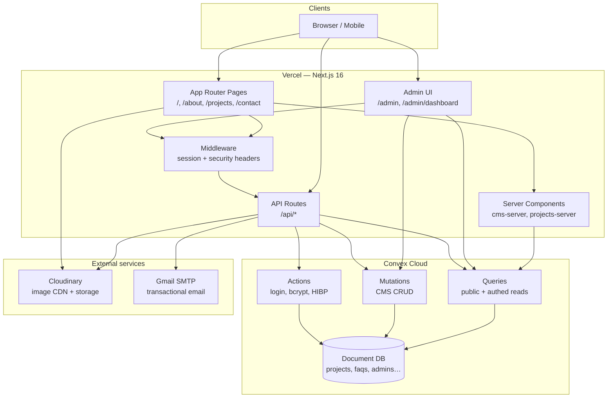

**How the pieces fit together**

| Surface | Reads from | Writes via |
|---|---|---|
| Public pages | Convex public queries (SSR) + Cloudinary URLs | Contact form → API → Convex + email |
| Admin dashboard | Convex reactive queries (`useQuery`) | Convex mutations + `/api/upload` |
| Auth | `/api/auth/*` → Convex actions | httpOnly cookie `malitos_session` |

---

## High-level component map

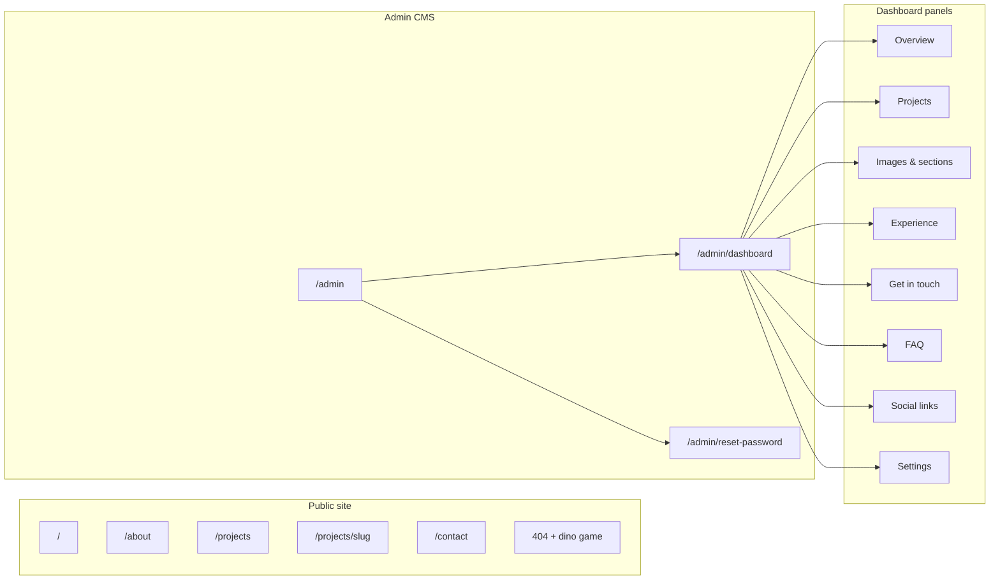

---

## Database schema

Convex uses a flat, relational document model. Tables and relationships:

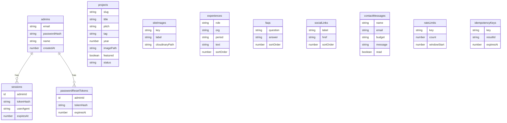

| Table | Purpose | Key indexes |
|---|---|---|
| `admins` | Admin accounts | `by_email` |
| `sessions` | httpOnly cookie sessions | `by_token`, `by_admin` |
| `projects` | Portfolio case studies | `by_slug`, `by_created`, `by_year` |
| `siteImages` | Hero, portrait, section images | `by_key` |
| `experiences` | Work history | `by_sort` |
| `faqs` | FAQ accordion content | `by_sort` |
| `socialLinks` | Footer / social URLs | `by_sort` |
| `contactMessages` | Inbound contact form | `by_created` |
| `passwordResetTokens` | 6-digit reset codes (hashed) | `by_token`, `by_admin` |
| `rateLimits` | Login / contact / reset throttling | `by_key` |
| `idempotencyKeys` | Duplicate contact submit protection | `by_key` |

---

## Data flow diagrams

### Public page render (SSR)

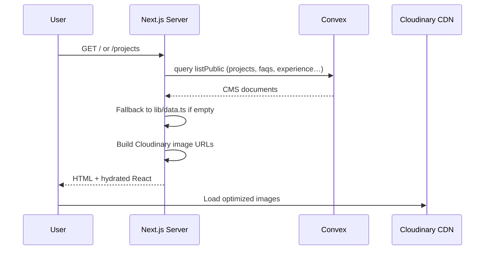

### Contact form submission

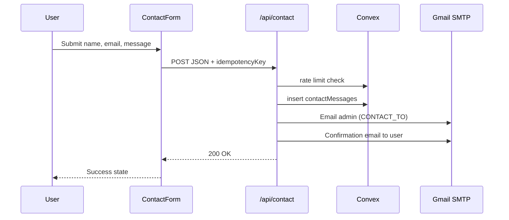

### Admin CMS edit (real-time)

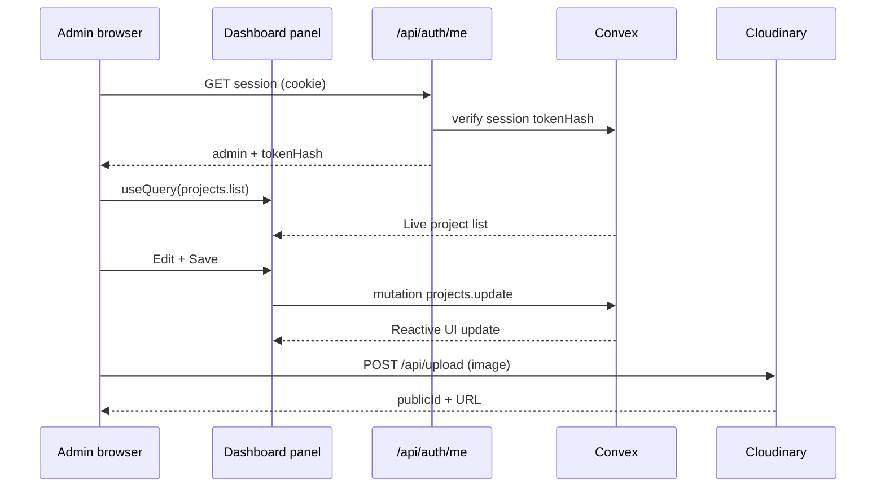

### Image upload pipeline

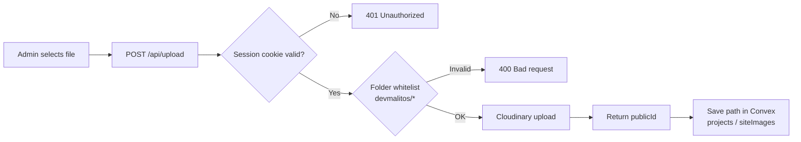

---

## Authentication flow

### Login

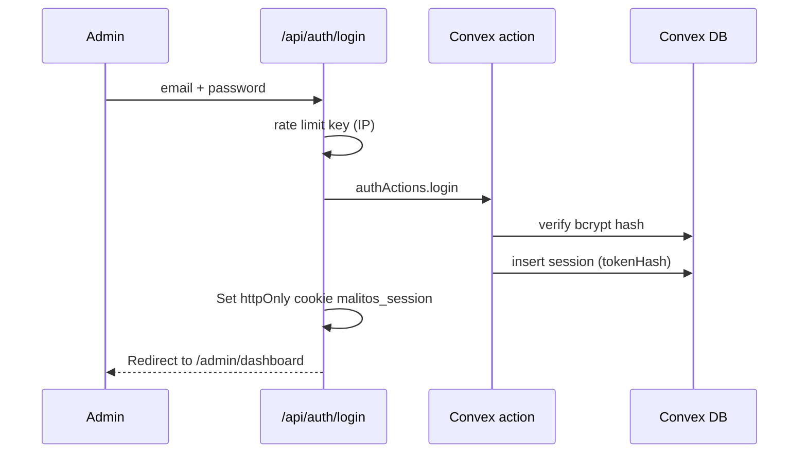

### Password reset (6-digit OTP)

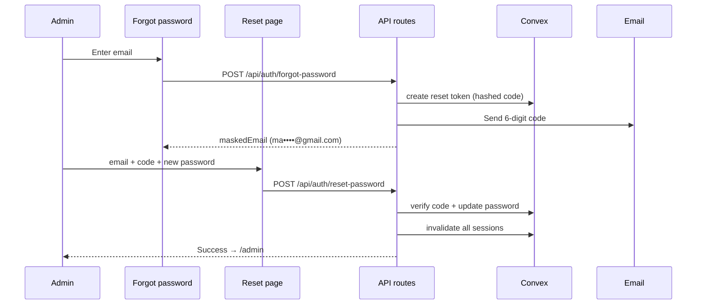

### Session protection layers

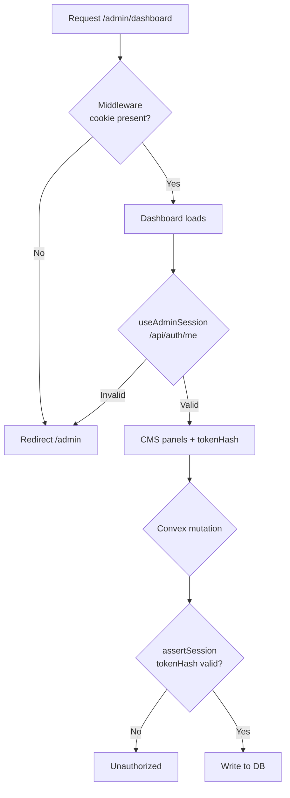

---

## Development workflow

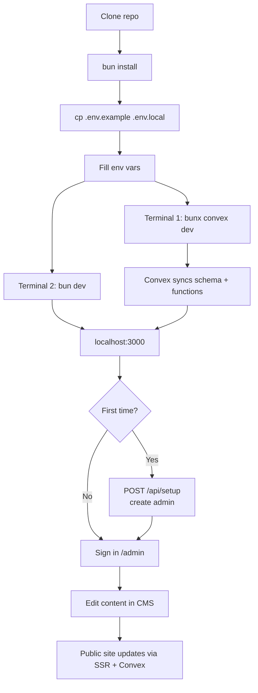

### Day-to-day commands

| Task | Command |
|---|---|
| Start frontend | `bun dev` |
| Start Convex sync | `bunx convex dev` |
| Local prod build | `bun run build:local` |
| Lint | `bun run lint` |
| Seed Cloudinary images | `bun run seed:images` |
| Check deploy env | `bun run verify:deploy` |

---

## Deployment workflow

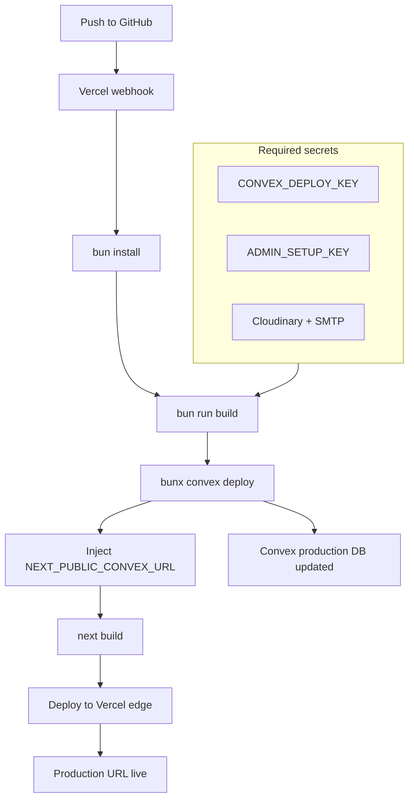

### Environment split

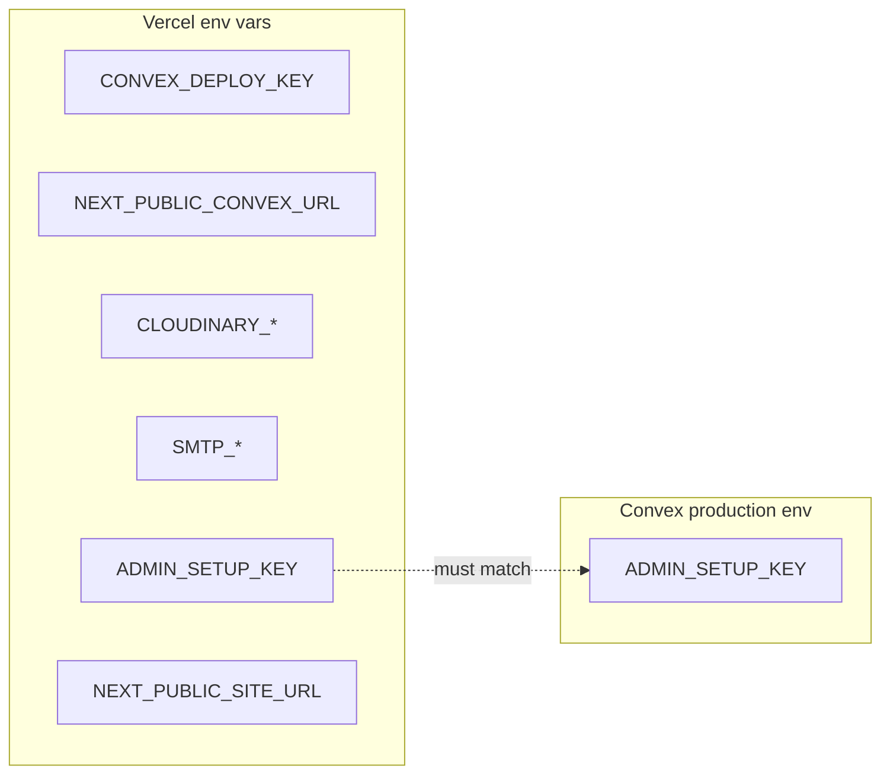

---

## Project structure

```
devmalitos/
├── app/                          # Next.js App Router
│   ├── layout.tsx                # Root layout (Navbar, SmoothScroll, Grain)
│   ├── page.tsx                  # Home
│   ├── about/                    # About page
│   ├── contact/                  # Contact page
│   ├── projects/                 # Project list + [slug] detail
│   ├── privacy/ | terms/       # Legal pages
│   ├── not-found.tsx             # 404 + dino game
│   ├── admin/                    # Admin login, dashboard, reset-password
│   └── api/                      # Route handlers
│       ├── auth/                 # login, logout, me, forgot/reset password
│       ├── contact/              # Contact form
│       ├── upload/               # Cloudinary upload (admin)
│       └── setup/                # One-time admin creation
├── components/
│   ├── admin/                    # CMS panels (Projects, FAQ, Images…)
│   ├── Dino404/                  # 404 page + canvas game
│   ├── Hero.tsx, Work.tsx…       # Public marketing sections
│   ├── Navbar.tsx, Footer.tsx
│   └── ConvexClientProvider.tsx  # Admin real-time Convex client
├── convex/                       # Convex backend
│   ├── schema.ts                 # Database schema
│   ├── auth.ts | authActions.ts | authMutations.ts
│   ├── projects.ts | faqs.ts | experiences.ts | socialLinks.ts
│   ├── siteImages.ts | messages.ts | dashboard.ts
│   └── lib/                      # session helpers, rate limiting
├── lib/                          # Shared server + client utilities
│   ├── cms-server.ts             # SSR fetch from Convex (+ fallbacks)
│   ├── projects-server.ts
│   ├── auth.ts | session-server.ts | email.ts
│   └── cloudinary-server.ts
├── scripts/
│   ├── seed-cloudinary.mjs
│   └── verify-deploy-env.mjs
├── middleware.ts                 # Admin route guard + security headers
├── vercel.json                   # Vercel build + region config
├── .env.example                  # Env template (safe to commit)
└── bun.lock                      # Bun lockfile (commit this)
```

---

## API routes

| Route | Method | Auth | Purpose |
|---|---|---|---|
| `/api/auth/login` | POST | — | Sign in, set httpOnly cookie |
| `/api/auth/logout` | POST | Cookie | Clear session |
| `/api/auth/me` | GET | Cookie | Current admin + tokenHash |
| `/api/auth/forgot-password` | POST | — | Send 6-digit reset code |
| `/api/auth/reset-password` | POST | — | Verify code, set new password |
| `/api/auth/change-password` | POST | Cookie | Change password (settings) |
| `/api/auth/sessions` | GET/DELETE | Cookie | List / revoke sessions |
| `/api/contact` | POST | — | Contact form → Convex + email |
| `/api/upload` | POST | Cookie | Admin image upload → Cloudinary |
| `/api/setup` | POST | Setup key | One-time admin bootstrap |
| `/api/projects` | GET | — | Public projects JSON |
| `/api/messages` | GET | Cookie | Admin message list |

---

## Quick start

```bash
# Install dependencies
bun install

# Copy env template and fill in values
cp .env.example .env.local

# Terminal 1 — Convex dev server
bunx convex dev

# Terminal 2 — Next.js
bun dev
```

Open [http://localhost:3000](http://localhost:3000).

---

## Environment variables

Copy `.env.example` → `.env.local` and set:

| Variable | Purpose |
|---|---|
| `NEXT_PUBLIC_CONVEX_URL` | Convex cloud URL |
| `CONVEX_DEPLOYMENT` | e.g. `dev:striped-starfish-858` |
| `NEXT_PUBLIC_CLOUDINARY_CLOUD_NAME` | Cloudinary cloud name |
| `CLOUDINARY_API_KEY` / `CLOUDINARY_API_SECRET` | Server-side uploads |
| `SMTP_*` / `CONTACT_TO` | Contact form + admin emails |
| `ADMIN_SETUP_KEY` | One-time admin creation (long random string) |
| `NEXT_PUBLIC_SITE_URL` | Production site URL |

**Never commit `.env.local` or share API secrets.**

---

## Admin CMS

| URL | Purpose |
|---|---|
| `/admin` | Sign in |
| `/admin/dashboard` | CMS (projects, images, experience, messages, FAQ, socials, settings) |
| `/admin/reset-password` | Enter 6-digit reset code |

### CMS feature map

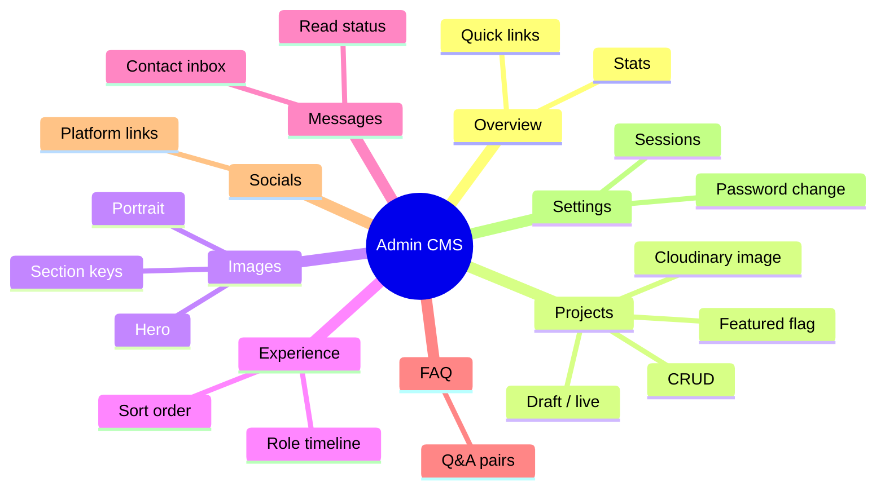

### First-time setup

Create the admin account once (only works when no admin exists):

```bash
curl -X POST http://localhost:3000/api/setup \
  -H "Content-Type: application/json" \
  -d '{
    "email": "you@example.com",
    "password": "YourSecurePassword123",
    "name": "Your Name",
    "setupKey": "YOUR_ADMIN_SETUP_KEY_FROM_ENV"
  }'
```

### Forgot password flow

1. Click **Forgot password?** on `/admin`
2. Enter your admin email → a **6-digit code** is emailed
3. UI shows masked email (e.g. `ma••••••@gmail.com`)
4. Go to **Enter reset code** → email + code + new password

---

## Scripts

```bash
bun dev               # Next.js dev server
bunx convex dev       # Convex dev (keep running)
bun run build:local   # Local Next.js production build (no Convex deploy)
bun run build         # Production: deploy Convex + build Next.js (Vercel)
bun run verify:deploy # Check required env vars before shipping
bun run lint          # ESLint
bun run seed:images   # Upload default images to Cloudinary
```

---

## Deploy to Vercel

This project uses **Bun** on Vercel and deploys **Convex** during the Vercel build.

### 1. Push to GitHub

Ensure `bun.lock` is committed. Vercel auto-detects Bun from the lockfile.

### 2. Import in Vercel

1. [vercel.com/new](https://vercel.com/new) → import your repo
2. Framework: **Next.js** (auto-detected)
3. Install command: `bun install` (set in `vercel.json`)
4. Build command: `bun run build` (deploys Convex, then runs `next build`)

### 3. Environment variables (Vercel → Settings → Environment Variables)

Set these for **Production** (and Preview if you want admin CMS on previews):

| Variable | Notes |
|---|---|
| `CONVEX_DEPLOY_KEY` | From [Convex Dashboard](https://dashboard.convex.dev) → Project → Settings → **Deploy Key** |
| `NEXT_PUBLIC_CONVEX_URL` | Filled automatically by `convex deploy` during build; optional to set manually |
| `NEXT_PUBLIC_CLOUDINARY_CLOUD_NAME` | Cloudinary |
| `CLOUDINARY_API_KEY` / `CLOUDINARY_API_SECRET` | Server uploads |
| `SMTP_*` / `CONTACT_TO` | Contact form + password reset emails |
| `ADMIN_SETUP_KEY` | Strong random string (same value as Convex prod — see below) |
| `NEXT_PUBLIC_SITE_URL` | `https://malitos.dev` (your live domain) |

**Do not** set `CONVEX_DEPLOYMENT=dev:...` on Vercel — production uses `CONVEX_DEPLOY_KEY`.

### 4. Convex production environment

In Convex Dashboard → **Production** deployment → **Settings → Environment Variables**:

| Variable | Purpose |
|---|---|
| `ADMIN_SETUP_KEY` | Must match Vercel (used by `createAdmin` mutation) |

Deploy Convex functions to production once locally if needed:

```bash
bunx convex deploy
```

### 5. Custom domain

In Vercel → **Domains**, add `malitos.dev` (and `www` if used). Update `NEXT_PUBLIC_SITE_URL` to match.

### 6. First admin on production

After the first successful deploy:

```bash
curl -X POST https://malitos.dev/api/setup \
  -H "Content-Type: application/json" \
  -d '{
    "email": "you@example.com",
    "password": "YourSecurePassword123",
    "name": "Your Name",
    "setupKey": "YOUR_ADMIN_SETUP_KEY"
  }'
```

### 7. Pre-flight check

```bash
# Load production-like vars, then:
bun run verify:deploy
```

### Production checklist

- [ ] Set a strong `ADMIN_SETUP_KEY` on **Vercel and Convex production**
- [ ] Add `CONVEX_DEPLOY_KEY` to Vercel
- [ ] Use Gmail **App Password** for `SMTP_PASS`
- [ ] Set `NEXT_PUBLIC_SITE_URL` to your live domain
- [ ] Rotate secrets if they were ever committed or shared
- [ ] Run `bun run verify:deploy` before first production deploy

---

## Security

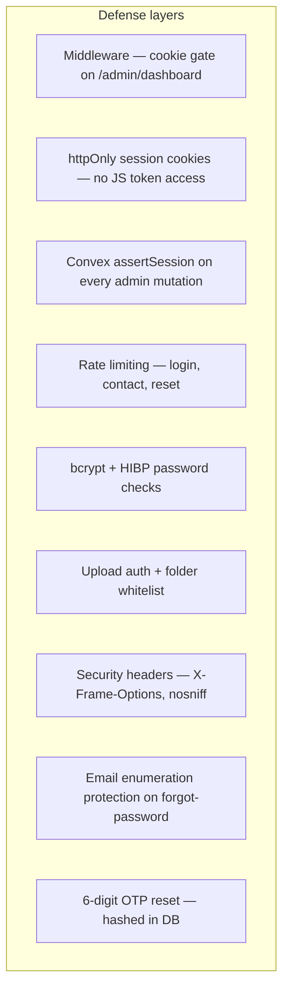

| Control | Implementation |
|---|---|
| Admin auth | httpOnly `malitos_session` cookie + Convex session table |
| Password storage | bcrypt (12 rounds) in Convex |
| Brute force | Convex `rateLimits` table |
| Reset codes | 6-digit OTP, SHA-256 hashed, 1h expiry |
| Uploads | Session required; only `devmalitos/*` folders |
| XSS in emails | HTML escaped in templates |
| CSRF | SameSite=Lax cookies; mutations require valid session |

---

## Convex deployment

- **Dashboard:** [devmalitos / striped-starfish-858](https://dashboard.convex.dev/t/mowlid-mohamoud-haibe/devmalitos/striped-starfish-858)
- **Dev:** `bunx convex dev` during development
- **Prod:** `bun run build` on Vercel (includes `convex deploy`) or `bunx convex deploy` manually

---

## License

Private — © Mowlid Haibe / Malitos
